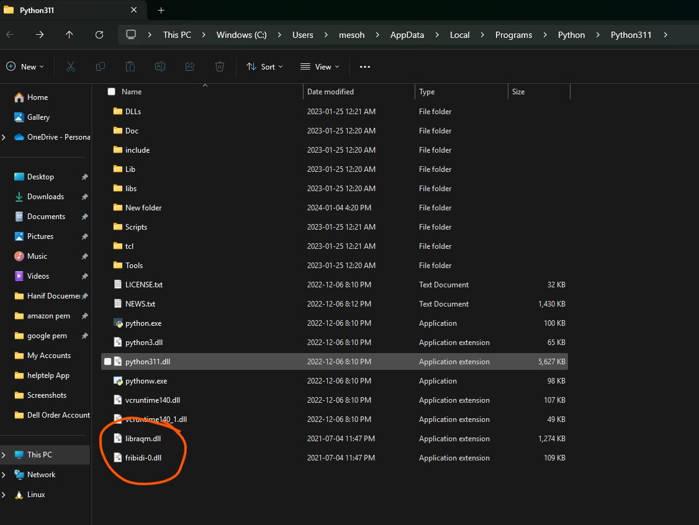

## Download the files form here:
`libraqm‑0.7.1.dll.zip`
```
https://www.lfd.uci.edu/~gohlke/pythonlibs/
```
Extract that zip and you will find the following two files:
```
libraqm.dll 
fribidi-0.dll
```
After that copy the two files where the `python.exe` file located.
For my case: it is `C:\Users\mesoh\AppData\Local\Programs\Python\Python311`



## Code using Numpy, Pillow, OpenCV
```
import numpy as np
from PIL import ImageFont, ImageDraw, Image
import cv2

## Make canvas and set the color
img = np.zeros((200,400,3),np.uint8)
b,g,r,a = 0,255,0,0

## Use simsum.ttc to write Chinese.
fontpath = "./siyam.ttf"
font = ImageFont.truetype(fontpath, 32)
img_pil = Image.fromarray(img)
draw = ImageDraw.Draw(img_pil)
draw.text((50, 100),  'হানিফ আলী সোহাগ', font = font, fill = (b, g, r, a))
img = np.array(img_pil)

## Display
cv2.imshow("res", img);cv2.waitKey();
cv2.destroyAllWindows()
cv2.imwrite("res.png", img)

```
### Before
The output like this:


### After
The output should looks like this:


## Code using Pillow, OpenCV
```
from PIL import ImageFont, Image, ImageDraw, ImageChops, ImageOps,features

print ("RAQM Status: ",features.check('raqm'))
w, h = 64, 64
w0, h0 = 256, 256
blank = Image.new('L', (w0 * 5, h0 * 3), 255)
font = 'siyam.ttf'
font = ImageFont.truetype(font=font, size=20, layout_engine=ImageFont.Layout.RAQM)
char = 'হানিফ আলী সোহাগ'
img = Image.new("L", (w0 * 5, h0 * 3), 255)
draw = ImageDraw.Draw(img)
draw.text((w0, h0), char, font=font)
diff = ImageChops.difference(img, blank)
lx, ly, hx, hy = diff.getbbox()
img = img.crop((lx, ly, hx, hy))

# Display the image
img.show()

# Save the image
img.save('image.png')

```

### Before
The output like this:


### After
The output should looks like this:


## References
* https://stackoverflow.com/questions/62939101/how-to-install-pre-built-pillow-wheel-with-libraqm-dlls-on-windows
* https://github.com/python-pillow/Pillow/issues/3593
* https://stackoverflow.com/questions/62939101/how-to-install-pre-built-pillow-wheel-with-libraqm-dlls-on-windows/75918197#75918197
* https://github.com/python-pillow/Pillow/issues/4859
* https://github.com/python-pillow/Pillow/blob/main/winbuild/build.rst
* https://github.com/fribidi/fribidi